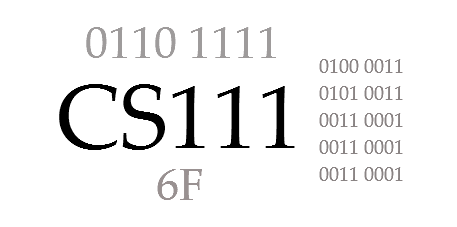

# CS 111 Introduction to Computer Science   
**Spring 2026**
**Section 01 - Indiana**   

---

## Instructor Information

**Instructor:** Dr. Jeff Lehman  

See contact information on Moodle.

> **Privacy Note:**  
> Instructor contact information is not listed in this public syllabus to reduce spam and protect privacy.  
> All enrolled students can find current contact details and office hours on Moodle.

---

## Meeting Time & Location

**Monday, Wednesday, and Friday**  
**1:00–1:50 pm**  
**Science Hall 175/177**  

> Note: There are two doors to enter the classroom—175 (left) and 177 (right).

---

## Course Description

An introduction to fundamental computer concepts and terminology applicable for communication in 
today’s world. Topics include historical perspective, computer architecture, operating systems, 
networking, impact of computing on society and current application areas, including spreadsheets, 
web page development and use of a programming language. Programming topics include input/output, 
loops, decision structures, arrays and methods. Attention is given to good programming style and 
problem-solving techniques for program design, coding, documentation, debugging and testing. *(3 credit hours; fall/spring/summer)*

This course integrates computing concepts and Python programming to build data-focused problem-solving skills for data analytics, prepare students for future coding courses, and provide practical Python literacy for all majors.

---

## Learning Outcomes

Students will be able to:

1. Demonstrate an understanding of fundamental computer concepts, including historical perspectives, binary and hexadecimal numbers, computer architecture, operating systems, networking and the Internet, and artificial intelligence, enabling them to engage with today’s digital world effectively.
2. Develop practical skills in application areas such as spreadsheets, web page development, and programming languages.
3. Design, implement, and document simple programs using basic programming constructs, including input/output operations, loops, decision structures, arrays, and methods.
4. Implement algorithms and apply problem-solving techniques, focusing on good programming style while performing effective debugging and testing to ensure code clarity and functionality.
5. Identify current ethical issues related to technology and the impact of computing on society, exploring how Christian values and Biblical insights apply.

---

## Required Texts and Resources

All required texts and readings are **free and open-source**. Check the course website for weekly readings and links.

- (Free online textbook) ***Welcome to CS*** by Andrew Scholer  
  <https://runestone.academy/ns/books/published/welcomecs2/welcomecs.html?mode=browsing>

- (Website) **W3Schools**  
  <https://www.w3schools.com/>

- (Website) **Geeks for Geeks**  
  <https://www.geeksforgeeks.org/>

- (Optional print book)
  ***Computer Science Illuminated*** by Nell Dale and John Lewis (7th edition recommended; any edition acceptable). *Note: Most students find the online text, websites, and instructor materials sufficient. This book is helpful for topics on Exam #1 and Exam #2.*

---

## Grading

Each course component is worth a specific number of points. The percentage of total points determines the final grade. The instructor reserves the right to adjust assignments and points while maintaining overall percentage weightings.

| Component                         | Points | Percent |
|-----------------------------------|--------|---------|
| Course Engagement                 | 50     | 5%      |
| Weekly Assignments (x13 approx.)  | 350    | 35%     |
| Discussion Questions (x10 approx.)| 50     | 5%      |
| Review Question Sets (x3)         | 50     | 5%      |
| Exams #1 & #2                     | 300    | 30%     |
| Exam #3 (final)                   | 200    | 20%     |
| **Total**                         | **1000** | **100%** |

### Grading Scale

- **A:** 93.0+  
- **A-:** 90.0–92.9  
- **B+:** 88.0–89.9  
- **B:** 83.0–87.9  
- **B-:** 80.0–82.9  
- **C+:** 78.0–79.9  
- **C:** 73.0–77.9  
- **C-:** 70.0–72.9  
- **D+:** 68.0–69.9  
- **D:** 63.0–67.9  
- **D-:** 60.0–62.9  
- **F:** 0–59.9  

---

## Course Engagement (5%)

Active Course Engagement is vital for success in this course. Weekly readings and videos present the course material and provide the background needed to complete assignments and prepare for exams. Students are responsible for reading all assigned materials and viewing the course videos. Students are encouraged to take notes summarizing topics covered in readings, videos, and class sessions. Students are encouraged to utilize office hours and send questions via email and text.

**Course Engagement grades** are recorded after each exam: 15 points after Exam #1, 15 points after Exam #2, and 20 points after Exam #3. Scores are based on attendance, in-class work, weekly assignments, timely discussion posts, communication with the instructor (such as asking questions or sharing insights), a participation self-reflection, and the instructor’s observations. **Course Engagement is not a single assignment but a cumulative assessment of participation and engagement over time.**

### Attendance

Class sessions enable you to engage with the material, providing opportunities to ask questions, participate in discussions, and work through assignments with instructor support. 

Attendance is recorded at the beginning of class. Students are expected to attend all class sessions, arrive on time, stay actively engaged, complete all in-class assignments, refrain from using phones/computers for non-course purposes, and remain in class for the entire session (except during breaks for emergencies). Late arrivals, early departures, and taking breaks during class may be treated as partial or full absences. 

Huntington University policy requires students to attend at least two-thirds (2/3) of scheduled class sessions in a face-to-face course. **Students who miss one-third or more of class meetings will automatically fail the course.** This total includes excused absences for athletics, music, other university activities, or illness. Students are responsible for all material they miss.

If you arrive late or need to leave early, use the door opposite the instructor (SH 175) workstation and do so quietly. Attending part of a session is better than missing entirely.

Do not attend class if you are sick. Your health and the health of others comes first.

If you miss class, please get in touch with Prof. Lehman. Students who miss multiple sessions may be referred to Student Services, the Dean’s Office, or the Registrar for support.

Virtual class sessions may be scheduled occasionally when the instructor has a course-related conflict. These sessions are considered regular class meetings, and attendance and participation are required.

---

## Weekly Assignments (35%)

Weekly Assignments are a central part of **Course Engagement** in this course. They are designed to help you practice new concepts, apply what you are learning, and reflect on your progress throughout the semester.

Weekly assignments help students apply and integrate concepts discussed in the text, online resources, and class sessions (in-person). The material covered in these assignments will assist students in preparing for exams and projects. Students should ensure that all submitted work is neat, organized, and clearly labeled with their first and last name. Assignments should be submitted through Moodle unless otherwise instructed.

Success in this course depends on steady participation and consistent effort rather than last-minute work. Weekly assignments are intended to be worked on throughout the week as part of regular course engagement.

Unless otherwise noted, **all assignments are due by Monday at 5:00 pm Indiana (Eastern) Time**. For students in Arizona, this corresponds to **3:00 pm before March 8** and **2:00 pm on March 8 and after**.

Students are always encouraged to ask questions. The instructor will try to respond within 24 hours on weekdays (usually more quickly!); questions asked late at night or over the weekend may be answered the next business day.

- Assignments must be submitted through Moodle unless otherwise instructed.  
- Late work is accepted up to **48 hours after the deadline with a 10% penalty per assignment** (based on the total points for that assignment), unless otherwise noted.  
- In cases of extreme hardship or documented circumstances, students should notify the instructor as soon as possible.  
- Grades will be posted in Moodle. Students are responsible for reviewing their grades and reporting discrepancies promptly.

---

## Discussion Questions (5%)

Most weeks include required **Discussion Questions** in a Moodle discussion forum. Each week has its own dedicated forum with several questions related to the course material.

Students are required to post responses to **all listed questions** by **Monday at 5:00 pm (Indiana Time)** unless otherwise noted. Posts should demonstrate critical thinking, original perspectives, and engagement with the course topics. Late postings do not receive credit.

Students are encouraged to post their discussion responses by **Friday each week** to promote interaction and allow time for meaningful discussion, even though the final deadline is Monday. Some weeks may require a **second post**, although most weeks only require answering the assigned questions. Students are encouraged (but not required) to respond to classmates, ask questions, share insights, and provide links to relevant or related information. All discussion interactions must remain respectful and appropriate.

Students should plan to engage with discussion questions throughout the week rather than waiting until the deadline. Completion of discussion questions is part of the course grade and timely posts contribute to the Course Engagement grade. Specific requirements and deadlines are listed in Moodle.

---

## Review Question Sets (5%)

Review questions will be posted for each topic to help reinforce your understanding of the material. These questions are similar to those you will encounter on exams. You are encouraged to work through them until you answer all questions correctly. Although they are listed as a 'Quiz' in Moodle, you can submit your answers multiple times, with your highest score being recorded. The review questions are open-book.

---

### Programming Tools

- **Python 3** will be used for coding assignments.
- **Thonny IDE** (recommended offline editor): <https://thonny.org/>  
- **Google Colab** (Python examples): <https://colab.google/>  
- **GitHub** (hosting web pages): <https://github.com/>

---

## Academic Honesty and Plagiarism

Integrity is essential. Plagiarism includes submitting work that is not your own, copying answers, failing to cite sources, using AI when prohibited, or treating individual assignments as group work.

Consequences may include a failing assignment grade, failure of the course, and referral to the Academic Dean.

Plagiarism is using another’s ideas, information, or wording without proper acknowledgment. All quoted, paraphrased, or summarized material must be cited. Common knowledge is the only exception.

---

## AI Statement

This course permits AI tools (e.g., ChatGPT, Google Gemini, Microsoft Copilot, Grammarly) to assist with learning and development.

Students may use AI to:
- Understand concepts  
- Receive feedback on writing  
- Debug code  
- Generate practice problems  

Students must understand and be able to explain all submitted work. AI tools are **not allowed on exams**.

Assignments will include AI usage guidelines:  
- **Red:** No AI use  
- **Yellow:** Limited / cautious AI use    
- **Green:** AI freely allowed  
 

Improper AI use is considered cheating and/or plagiarism.

---

## Disability and Accessibility Policy

In compliance with Section 504 and the ADA, Huntington University provides reasonable accommodations.

Contact the **Academic Center for Excellence (ACE)**:  
- Phone: 260-359-4290  
- Email: ace@huntington.edu  

Faculty will work with ACE to support eligible students.

---

## Schedule and Exams

Exams are **closed notes**. Review topics and sample questions are provided. Exams #1 and #2 are online and require Respondus browser and a web camera. 

- **Exam #1: February 9 to 15 (On-line via Respondus Browser)**
- **Exam #2: March 23 to 29 (On-line via Respondus Browser)**
- **Final Wednesday April 29th 10:30 AM (in-person)**

> The schedule may change slightly. Check the course website for updates.

### Weekly Schedule

| Week | M     | W     | F     | Topics                               |
|------|-------|-------|-------|--------------------------------------|
| 1    | 1/12  | 1/14  | 1/16  | Welcome, History, Binary             |
| 2    | **MLK**   | 1/21  | 1/23  | Hex, ASCII, Compression              |
| 3    | 1/26  | 1/28  | 1/30  | Logic, Hardware                      |
| 4    | 2/2   | 2/4   | 2/6   | Review                               |
| 5    | 2/9   | 2/11  | 2/13  | **Exam #1 (online)**, Operating Systems, Files    |
| 6    | 2/16  | 2/18  | 2/20  | Cloud Apps, Spreadsheets             |
| 7    | 2/23  | 2/25  | 2/27  | Networking, Web (HTML, CSS)          |
| 8    | **Break** | **Break** | **Break** |                                      |
| 9    | 3/9   | 3/11  | 3/13  | Security, AI                         |
| 10   | 3/16  | 3/18  | 3/20  | Ethical Issues, Review               |
| 11   | 3/23  | 3/25  | 3/27  | **Exam #2 (online)**, Programming (Python)        |
| 12   | 3/30  | 4/1   | **Easter**| Planning (IPO), Input/Output         |
| 13   | **Easter**| 4/8   | 4/10  | Selection (if)                       |
| 14   | 4/13  | 4/15  | 4/17  | Repetition (loops, lists)            |
| 15   | 4/20  | 4/22  | 4/24  | Debugging, API’s                     |
| 16   |       |       |       | **Final Wednesday April 29th 10:30 AM (in-person)** |

---

*Last modified: Thursday, January 9, 2026*

---
