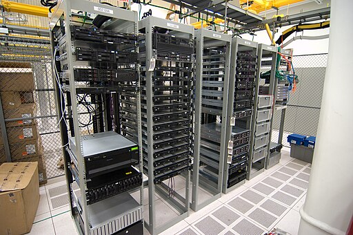
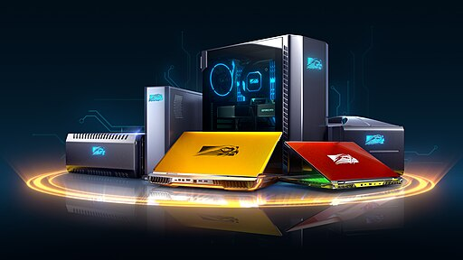
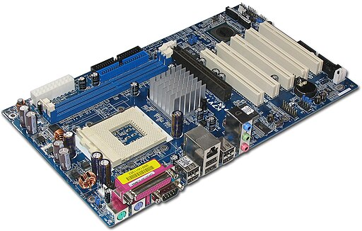

# Computer Hardware
Prof. Lehman

---

## Types of Computers
- Supercomputer (most powerful and expensive)
- Server
- Desktop / Laptop
- Tablet / Smartphone
- Embedded computer (least powerful, task-specific)

## Supercomputers
* **Fastest and most powerful computers**, capable of performing massive numbers of calculations per second  
* Designed for **highly complex problems** beyond the capabilities of typical computers  
* Used for **weather prediction, scientific research, simulations, and AI training**  
* Examples include **climate modeling, space exploration, and genome analysis**  
* **Top 500 Supercomputers (updated twice per year November and June):**
*  https://www.top500.org

  
*Supercomputer Image: Argonne National Laboratory's Flickr page, CC BY-SA 2.0 <https://creativecommons.org/licenses/by-sa/2.0>, via Wikimedia Commons*

## Servers
* Computers designed to **provide services or resources** to other computers over a network  
* Optimized for **reliability, availability, and performance** rather than direct user interaction  
* Commonly used to host **websites, databases, file storage, and email systems**  
* Often more powerful than desktop computers and designed to run continuously  
* Can range from a **single machine** to many computers in large-scale data centers  
* **Examples:** web servers, database servers, file servers, Moodle servers  

  
*server image: Alexis Lê-Quôc from New York, United States, CC BY-SA 2.0 <https://creativecommons.org/licenses/by-sa/2.0>, via Wikimedia Commons*

## Desktop and Laptop Computers
* **General-purpose personal computers** designed for individual users  
* Desktops emphasize **performance, expandab+ility, and lower cost**; laptops emphasize **portability and convenience**  
* Commonly used for **school, work, programming, gaming, and everyday tasks**  
* Generally less powerful than servers or supercomputers, but more flexible for personal use  
* Most commonly run **Windows 11, macOS, Chrome OS (Chromebooks), or Linux**  
* **Manufacturers:** Dell, HP, Lenovo, Apple, Acer, ASUS  

  
  
*desktop and laptop image: Felipe Mirez, CC BY-SA 4.0 <https://creativecommons.org/licenses/by-sa/4.0>, via Wikimedia Commons*

## Tablet and Smartphone Computers
* **Mobile computing devices** designed for portability and ease of use  
* Primarily use **touch-based interfaces** instead of keyboards and mice  
* Optimized for **communication, media consumption, and mobile apps**  
* Include built-in sensors such as **GPS, cameras, accelerometers, and biometric readers**  
* Most commonly run **iOS or Android**  
* Includes specialized mobile devices such as **e-readers (e.g., Kindle, Nook)** optimized for specific tasks  
  
  
*tablet image: Geralt, CC0, via Wikimedia Commons*

## Embedded Computers
* Computers **built into other devices** to perform a specific, dedicated function  
* Designed for **efficiency, reliability, and predictable operation** rather than general use  
* Often have **limited memory, storage, and user interfaces**  
* Found in everyday systems such as **cars, appliances, medical devices, and industrial equipment**  
* Usually run **special-purpose software or real-time operating systems**  
* **Examples:** car engine controllers, microwaves, thermostats, crock pots, washing machines

---

## All Computers Share the Same Basic Model
* All computers—regardless of size or purpose—use the same basic components  
* These components work together using the **Input–Processing–Storage–Output (IPSO)** model  
* **Input:** data enters the computer  
* **Processing:** the CPU performs calculations and decisions  
* **Storage:** data and programs are saved for **short-term** or **long-term** use  
* **Output:** results are presented to the user or another system

## Central Processing Unit (CPU)
* The **Central Processing Unit (CPU)** is the main processing component of a computer  
* Responsible for **executing program instructions**  
* Performs **calculations, comparisons, and decision-making**  
* Coordinates the actions of other hardware components during program execution  
* In the IPSO model, the CPU represents **Processing**

## Inside the CPU
* The CPU is made up of several key components  
* The **Arithmetic Logic Unit (ALU)** performs arithmetic calculations and logical comparisons  
* The **Control Unit** directs and coordinates the execution of instructions  
* Together, these components allow the CPU to execute programs correctly and efficiently

## Clock Speed (CPU Speed)
* Clock speed measures how fast the CPU’s internal clock cycles  
* Measured in **Gigahertz (GHz)** — billions of cycles per second  
* Higher clock speeds generally allow the CPU to execute instructions faster  
* Overall performance also depends on factors such as **CPU cores, memory speed, and system design**

## CPU Cores
* A **CPU core** is an independent processing unit within a CPU  
* Modern CPUs often contain **multiple cores**  
* Multiple cores allow a computer to perform **multiple operations at the same time**  
* Programs must be designed to take advantage of **parallel processing** for cores to improve performance

---  
## Motherboard and Ports

* The **motherboard** is the main **printed circuit board (PCB)** of a computer  
* It holds and connects the **internal components**, including the CPU, memory, and storage  
* Provides **electrical pathways** that allow components to communicate  
* Includes **connectors, expansion slots, and ports** for internal and external devices

*Motherboard image: Darkone (talk · contribs), CC BY-SA 2.5 <https://creativecommons.org/licenses/by-sa/2.5>, via Wikimedia Commons*

---

## Common Computer Ports and Connections (2026)
* **USB-A / USB-C** – connect keyboards, mice, flash drives, and other peripherals  
* **USB-C / Thunderbolt** – high-speed data, video output, and power delivery  
* **HDMI / DisplayPort** – connect monitors and displays  
* **Ethernet (RJ-45)** – wired network connection  
* **Audio ports** – headphones, speakers, microphones  
* **Bluetooth (wireless)** – short-range connection for keyboards, mice, headphones, and other peripherals

* Modern laptops often use **USB-C ports** to replace many traditional connectors

---

## Why Memory Speed Matters
* The CPU must constantly access data and instructions to operate  
* Even fast CPUs are slowed down if data cannot be delivered quickly  
* Different types of memory provide different tradeoffs in **speed, size, and cost**  
* This leads to a structured **memory hierarchy**

## Memory Hierarchy Overview
* Computers use multiple layers of memory organized by **speed and capacity**  
* Faster memory is **closer to the CPU**, but smaller and more expensive  
* Slower memory is **larger and cheaper**, but farther from the CPU  
* Data is moved between these layers as needed during program execution

## Registers
* The **fastest type of memory** in a computer  
* Located **inside the CPU**  
* Hold data and instructions currently being processed by the CPU  
* Very small in size, but extremely fast

## Cache Memory
* Small, high-speed memory located **between the CPU and RAM**  
* Stores **frequently used data and instructions**  
* Reduces the time the CPU must wait for data from main memory  
* Faster than RAM, but slower than registers

## Main Memory (RAM)
* Stores programs and data currently in use  
* Serves as the computer’s primary **working memory**  
* Much larger than cache, but slower  
* **Volatile** — contents are lost when power is turned off

## Secondary Storage
* Used for **long-term data storage**  
* Retains data even when power is turned off  
* Much slower than RAM, but far larger and cheaper per unit of storage  
* Includes solid-state and mechanical storage devices

## Storage Types: SSD vs Mechanical Hard Drive
* **Solid-State Drives (SSD)** use flash memory and have no moving parts  
* **Mechanical hard drives** use spinning disks and moving read/write heads  
* SSDs are **much faster**, quieter, and more resistant to physical shock  
* Mechanical drives are typically **cheaper per gigabyte** and offer larger capacities

## Relative Speeds of Computer Memory
* **Fastest:** Registers  
* Cache memory  
* Main memory (RAM)  
* Solid-state storage (SSD)  
* **Slowest:** Mechanical hard drives  

*Note: As speed decreases, capacity increases*
 
## Memory Hierarchy Summary
* CPU performance depends heavily on **how quickly data can be accessed**  
* The memory hierarchy balances **speed, size, and cost**  
* All computers—from smartphones to supercomputers—use this same approach

---

## Moore’s Law and Modern CPU Design
* **Moore’s Law** observed that computing technology roughly doubled every **1.5–2 years**, driven by increasing transistor counts  
* This trend enabled decades of improvements in **performance, size, and cost**  
* Physical limits (heat, power, transistor size) have slowed this growth  
* Clock speeds no longer increase dramatically  
* To continue improving performance, modern CPUs use **multiple cores** and improved architectures  
* Performance gains now come from **parallel processing, memory systems, and specialized hardware**

## Moore’s Law Example: Memory Growth (2-Year Doubling)
Prof. Lehman's office computer had **128 MB of RAM in 2001**  
Moore's Law would predict 16 GB in 2015 assuming memory 
capacity doubled every **2 years**.

| Year | Predicted Memory |
|------|------------------|
| 2001 | 128 MB |
| 2003 | 256 MB |
| 2005 | 512 MB |
| 2007 | 1 GB |
| 2009 | 2 GB |
| 2011 | 4 GB |
| 2013 | 8 GB |
| 2015 | **16 GB** |

It was close! as office computer had 8 GB of memory in 2015

## Moore’s Law Example: Storage Growth (2-Year Doubling)

Assume a large hard drive is **4 TB in 2026** and storage capacity doubles every **2 years**.

| Year | Predicted Storage |
|------|------------------|
| 2026 | 4 TB |
| 2028 | 8 TB |
| 2030 | 16 TB |
| 2032 | 32 TB |
| 2034 | 64 TB |
| 2036 | 128 TB |
| 2038 | 256 TB |
| 2040 | 512 TB |
| 2042 | **1 PB (1024 TB)** |

---

## Common Computer Measurement Terms

| Term | Abbreviation | Approximate Value | Used For |
|-----|-------------|------------------|----------|
| Bit | b | 0 or 1 | Smallest unit of data |
| Byte | B | 8 bits | Basic unit of data storage |
| Kilobyte | KB | ~1,000 bytes | Small files, text |
| Megabyte | MB | ~1,000,000 bytes | Photos, small programs |
| Gigabyte | GB | ~1,000,000,000 bytes | Applications, videos |
| Terabyte | TB | ~1,000,000,000,000 bytes | Large storage devices |
| Gigahertz | GHz | Billions of cycles per second | CPU speed |

*Note:* Computers use base-2 (1 KB = 1,024 bytes), but base-10 values are fine for this course.

---
## Historical Long-Term Storage Devices and Capacities
| Device                     | Approximate Storage Capacity        | Approximate Years in Common Use |
|----------------------------|-------------------------------------|---------------------------------|
| Punch card                 | 80 bytes                            | 1890s – 1970s                   |
| 5.25" floppy disk          | 360 KB                              | Late 1970s – Early 1990s        |
| 3.5" floppy disk           | 1.44 MB                             | Late 1980s – Mid 2000s          |
| Iomega Zip disk            | 100 MB                              | Mid 1990s – Early 2000s         |
| CD-ROM                     | 650 MB                              | Mid 1990s – Late 2000s          |
| DVD-ROM                    | 4.7 GB                              | Early 2000s – Mid 2010s         |
| Blu-ray Disc               | 25 GB                               | Late 2000s – Late 2010s         |
| Hard disk drive (HDD) (*mechanical*)      | MB → TB (varies by era)             | Late 1980s – Present            |
| USB flash drive            | ~128 MB – 1 TB (varies by era)      | Early 2000s – Present           |
| Solid-state drive (SSD)    | ~64 GB → multiple TB                | Late 2000s – Present            |

*Storage capacity has grown from **bytes to terabytes** in a single human lifetime.*

---

## Current Desktop & Laptop Standards (January 2026)
* **Memory (RAM):** typically **8–32 GB**  
  *(16 GB is common; 32 GB or more for heavier workloads)*  
* **Storage:** SSDs are standard, often **256 GB to 2 TB**  
  *(larger capacities common in desktops or as secondary storage)*  
* **CPU Speed:** Modern CPUs commonly operate in the **~2–5 GHz** range  
  *(performance also depends on core count and architecture)*

## Computer Hardware — Big Picture Recap
* All computers use the same **Input–Processing–Storage–Output (IPSO)** model  
* The **CPU** performs processing using clock cycles and multiple cores  
* Performance depends on **cores, memory speed, and system design**, not just GHz  
* Computers use a **memory hierarchy** to balance speed, size, and cost  
* Different types of computers exist because **different tasks require different tradeoffs**

-- end --
