# History Overview
**Dr. Lehman**

---

## Early Mechanical Computers

---

## Abacus

The **abacus** is an ancient tool used for performing mathematical calculations. It consists of a frame with rods or wires on which beads are strung. The beads are moved up and down the rods to represent numbers and perform calculations.

The abacus has been used for thousands of years, with its origins likely dating back to Mesopotamia around **2700–2300 BC**. It was used throughout the ancient world, including in Egypt, Greece, Rome, China, and Japan. In Europe, the abacus fell out of favor after the introduction of the Hindu-Arabic numeral system in the Middle Ages. However, it is still used in some parts of the world today, particularly in China and Japan.

**Try it online:**  
- Try Abacus Online: http://www.alcula.com/calculators/abacus/

### Examples of abacuses

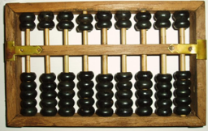

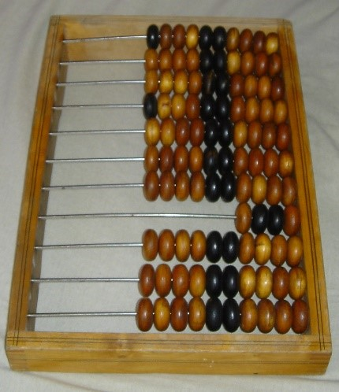

---

## Napier’s Bones

**John Napier** (1550–1617), a Scottish mathematician, created a set of “rods” or “bones” used by merchants to multiply two numbers.

- The **first number** is single digit.  
- The **second number** is formed by arranging appropriate rods for each digit.  
- Add numbers in diagonal columns to multiply.

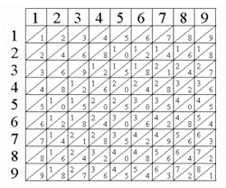

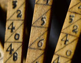

---

## Napier’s Bones Example

**The sample shown** demonstrates how to multiply **35 by 2**. The first digit is 0 and then the 6 and 1 are added to form 7 as the second digit, thus **35 × 2 = 70**.

**The sample shown** demonstrates how to multiply **35 by 4**. The first digit is 0 and then the 2 and 2 are added to form 4 as the second digit, and 1 is the third digit, thus **35 × 4 = 140**.

**The sample shown** demonstrates how to multiply **35 by 9**. The first digit is 5 and then 4 and 4 are added to form 11. In this case we use 1 as the second digit, carry the other 1 adding it to 2 giving 3 as the third digit, thus **35 × 9 = 315**.

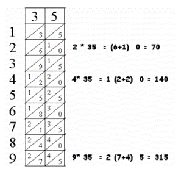

---

## Slide Rule

The **slide rule** was developed primarily by English mathematician and clergyman **Reverend William Oughtred** in the early 17th century. He drew inspiration from the emerging work on logarithms by John Napier, who had invented logarithmic scales for calculation.

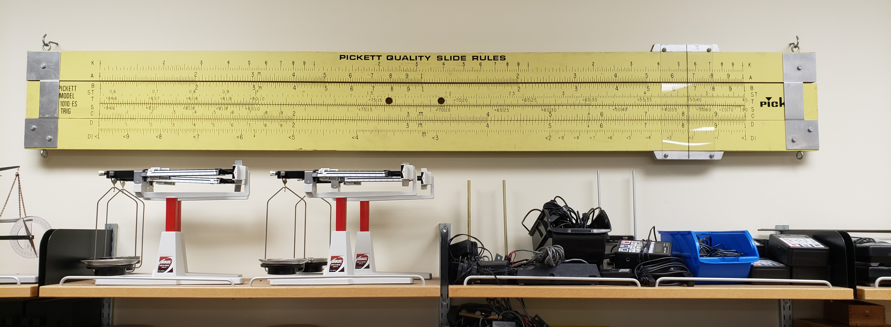

**Try one online:**  
- https://www.antiquark.com/sliderule/sim/n909es/virtual-n909-es.html

---

## Log Tables

Use logarithms. Multiply and divide by adding/subtracting numbers in a lookup table. Used before calculators were widely available.

Babbage’s Log Book at Google Books:  
- https://books.google.com/books?id=piNNAAAAMAAJ&lpg=PR12&ots=N4yrKIWfUL&dq=inauthor%3A%22Charles%20Babbage%22%20logarithms&pg=PR2#v=onepage&q&f=false

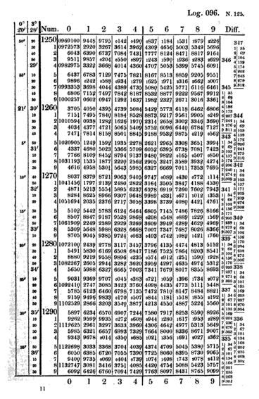

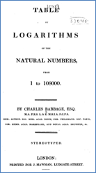

---

## Burroughs “Portable”

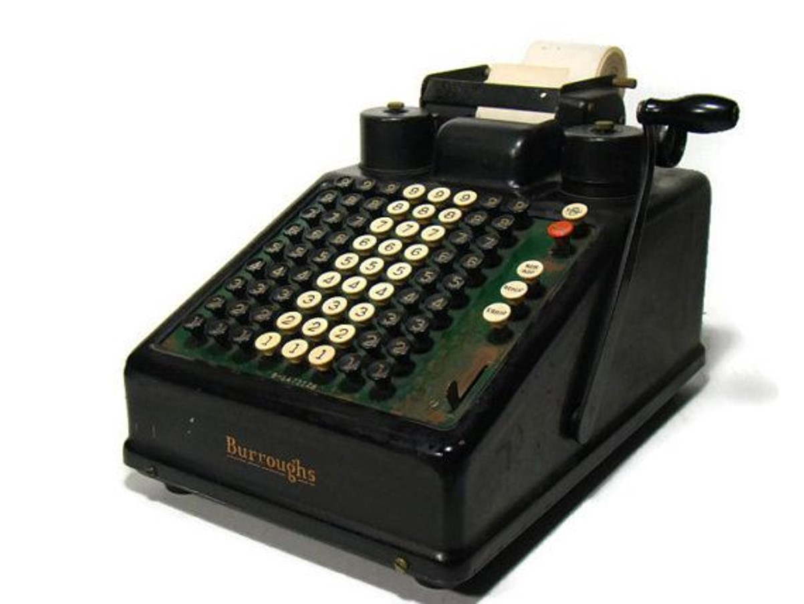

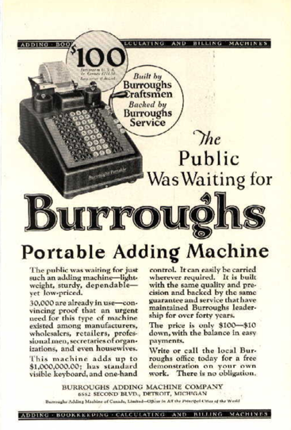

---

## Mechanical Adders

### Gem Adding Machine

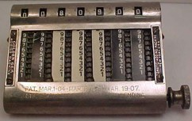

### Addometer

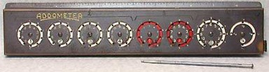

### Addiator

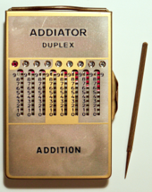

---

## 1800’s — Babbage and Lovelace

**Charles Babbage** (1837–1871) is given credit for the “idea” of a mechanical computer.

- Babbage created the **Difference Engine**, a single-purpose automatic mechanical calculator for polynomial functions.
- Babbage designed (but never fully created) the **Analytical Engine**, which many consider the first **general-purpose mechanical computer**.

**Ada Lovelace** is considered the “**first programmer**” as she wrote program instructions for Babbage’s Analytical Engine.

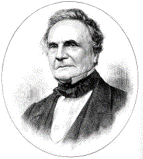

---

## 1800’s — Jacquard and Hollerith

**Joseph Jacquard** was a French inventor who revolutionized the textile industry with a programmable loom using **punch cards** that laid the foundation for storing data in early computers.

**Herman Hollerith** won the contract for the **1890 census**, processing data using sets of “punched cards.” His company later became **International Business Machines (IBM)**.

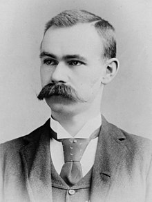

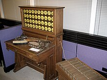

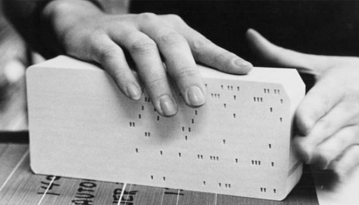

---

## Digital Computers

Digital computers arrive in the **1940’s** with calculation needs for World War II as a key driver.

### Distinction
- Early (first?) **single-purpose electronic computer**
- Early **general-purpose electro-mechanical computer**
- First **programmable electronic computer**
- First **general-purpose electronic computer**
- First **commercial computer in United States**

### Computer Milestones
- **ABC** (Atanasoff–Berry Computer), Iowa State, 1939–1941  
  https://en.wikipedia.org/wiki/Atanasoff%E2%80%93Berry_computer
- **Z1–Z4**, **Konrad Zuse**, Germany, early 1940’s  
  https://en.wikipedia.org/wiki/Konrad_Zuse
- **Colossus**, Tommy Flowers, Great Britain, 1943–44  
  https://en.wikipedia.org/wiki/Colossus_computer
- **ENIAC**, Mauchly/Eckert, PA, 1946  
  https://en.wikipedia.org/wiki/ENIAC
- **UNIVAC**, 1952  
  https://en.wikipedia.org/wiki/UNIVAC

---

## Key Technologies

- **Vacuum Tubes** (used in 1940’s to late 1950’s)  
- **Transistors** (1959)  
- **Integrated Circuits (IC)** (1965)

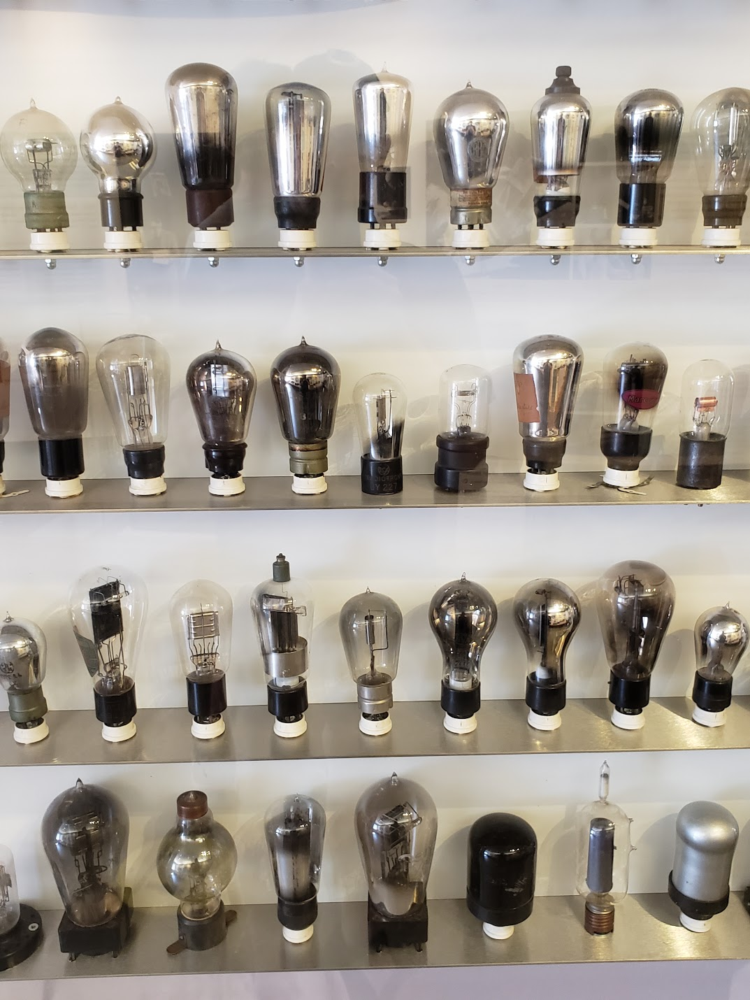

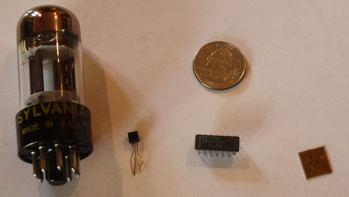

---

## Personal Computers

Personal computers first arrive in the **1970’s**.

- **1975** — **Altair** — early personal computer  
- **1976** — **Apple II** — Steve Jobs and Steve Wozniak — start of Apple  
- **1981** — **IBM PC** — Bill Gates and Microsoft OS — IBM is “late to the game,” licensing an OS from Microsoft (ancestor of today’s Windows PC)  
- **1984** — **Apple Macintosh** announced in Super Bowl ad — first commercially successful GUI  
  https://www.youtube.com/watch?v=2zfqw8nhUwA
- **1985** — **Microsoft Windows 1.0** — online demo  
  https://www.pcjs.org/software/pcx86/sys/windows/1.01/ega/

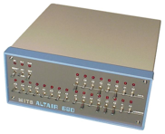

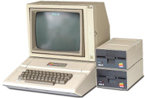

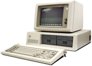

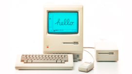

---

## Decades to Remember

**Decade — Technology**

- **1940’s** — First Digital Computers  
- **1950’s** — First commercial computers  
- **1960’s** — Mini computers (smaller affordable mainframes) and first computers connected (1969)  
- **1970’s** — Personal Computers  
- **1990’s** — WWW (1991) and Internet (dial-up) comes to homes; Linus Torvalds develops **Linux** (1991) which powers many servers today  
- **2000’s** — Smartphones (iPhone, 2007)  
- **2000’s** — Broadband Internet  

---

## Key Developments in the last 20 years?

It is often not easy to know what key developments are in technology until some time has passed. Here are some possible key developments:

- **iPod** — early mp3 player launched in 2001  
- **Netflix** — begins streaming videos in 2007  
- **Tablets** — first iPad 2010, but earlier tablets appeared in 1980’s and 1990’s  
- **Virtual Reality (VR)**  
- **Self-Driving Cars**  
- **Cryptocurrency**  
- **Unlimited Mobile Phone Data**  
- **Artificial Intelligence** (e.g., ChatGPT becomes popular in 2022?)  
- **Other?**

---

## More Information

- **Computer History Museum** — https://computerhistory.org/  
- **Huntington University Library** has a good selection of computing history books.

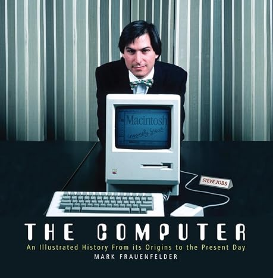

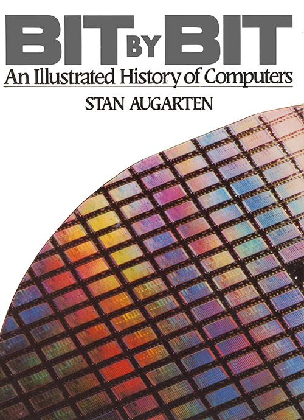

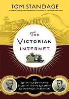

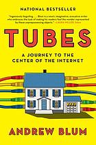
