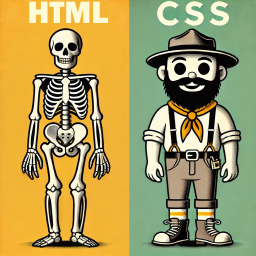

# Introduction to CSS

**Cascading Style Sheets (CSS)** are the recommended way to format your HTML web pages.

**HTML** specifies the **structure**  
**CSS** specifies the **formatting**

It is considered best practice to *separate the structure and formatting*.



For an introduction and reference to CSS visit [W3Schools](http://w3schools.com).

---

## Rules and Selectors

CSS consists of a set of formatting rules applied to elements via selectors. Each rule specifies a property and value. Multiple rules can be applied or *cascaded*. The selector describes the element for which the rule will be applied.

In the following example, the paragraph text is set to the color green with font size of 18pt. In this example the selector is for all paragraph tags, so the rules are applied to all paragraphs.

```css
p {
  color: green;
  font-size: 18pt;
}
```

Rendered example:

```html
<p style="color:green; font-size:18pt;">
  This is a sample paragraph with green 18pt text.
</p>
```

---

## Select By Element

Styles can be applied to all elements by specifying the **name of the element** and the **style properties**.

In this example all paragraph elements `<p>` will be formatted with `"Times New Roman"` font, font size 14 points, and have the first line of text indented .25". If `"Times New Roman"` is not available, `"Times"` will be used. If `"Times"` is not available a default `"serif"` font will be used.

The style definition for all `<p>` tags goes in the CSS style sheet:

```css
p {
  font-family: "Times New Roman", Times, serif;
  font-size: 14pt;
  text-indent: .25in;
}
```

The paragraph within the `<body>` tags:

```html
<p>
  This is a paragraph of text. This is a paragraph of text.
  This is a paragraph of text. This is a paragraph of text.
</p>
```

---

## Inline CSS

CSS styles can be defined for each element by adding the `style` attribute to the tag.

Styles defined this way only apply to a single element. This approach is OK for small web pages or occasional use, but is difficult to maintain for larger sites.

> **NOTE: Do not use Inline CSS for the CS111 Web Assignment**

Example:

```html
<p style="color:red; font-family:Arial;">
  This is a sample paragraph with red text using Arial font
</p>
```

---

## Internal CSS

CSS styles can be defined in the `<head>` section of your web page. Selectors are placed within the `<style>` tag.

Styles defined this way apply to the entire page. While this approach is OK for single web pages, it is not a good approach when styles need to be applied to more than one page.

> **NOTE: Do not use Internal CSS for the CS111 Web Assignment**

Example:

```html
<head>
  <style>
    body {
      background-color: #FFFFFF;
    }

    h1 {
      color: #00FF00;
    }
  </style>
</head>
```

---

## External CSS

CSS styles can also be defined as a separate file. Defining the CSS styles in a separate file allows the styles to be easily applied to multiple pages.

A link must be added to your web page to use an external style sheet.

Example linking to `style.css`:

```html
<head>
  <link rel="stylesheet" type="text/css" href="style.css" />
</head>
```

---

## Sample CSS File: `style.css`

The following CSS file demonstrates several selectors and common CSS formatting rules.

### Selectors

- **h1** – applies to all h1 tags (main heading)
- **p** – applies to all paragraphs
- **ol** – applies to all ordered lists
- **body** – applies to all content inside the body tag

### Rules

- **font-family** – specifies the font
- **list-style** – specifies list numbering style
- **color** – specifies text color (name or hex code)
- **background-color** – specifies background color (name or hex code)

```css
/*
style.css
demonstrates basic CSS rules
*/

h1 {
  font-family: "Comic Sans MS", Arial, sans-serif;
  color: orange;
}

p {
  color: green;
  font-size: 18pt;
}

ol {
  list-style: upper-roman;
}

body {
  background-color: #F0F0F0;
}
```

---

## (Optional) Select By Element ID

Styles can be applied to **single element instances** by declaring an `id`.  
An id must be unique. The `#` sign is used to denote the style for a specific id.

CSS:

```css
h3#special {
  color: red;
}
```

HTML:

```html
<h3>Heading</h3>

<h3 id="special">Heading</h3>

<h3>Heading</h3>
```

---

## (Optional) Select By Element Class

Styles can be applied to multiple element instances by assigning a class name to elements. The same class name can be reused.

CSS:

```css
ol.roman {
  list-style: upper-roman;
}
```

HTML:

```html
<ol class="roman">
  <li>one</li>
  <li>two</li>
  <li>three</li>
</ol>

<ol>
  <li>four</li>
  <li>five</li>
  <li>six</li>
</ol>

<ol class="roman">
  <li>seven</li>
  <li>eight</li>
  <li>nine</li>
</ol>
```

All elements with class `"roman"` will display upper-case Roman numerals.

---

## (Optional) Validating CSS

To ensure your CSS is correct you should **validate** your CSS at:

http://jigsaw.w3.org/css-validator/

Validating your CSS helps ensure all browsers render your pages correctly and efficiently.

Fix the first error (or two) and retry the validator. The total number of errors reported may not be accurate.

---


