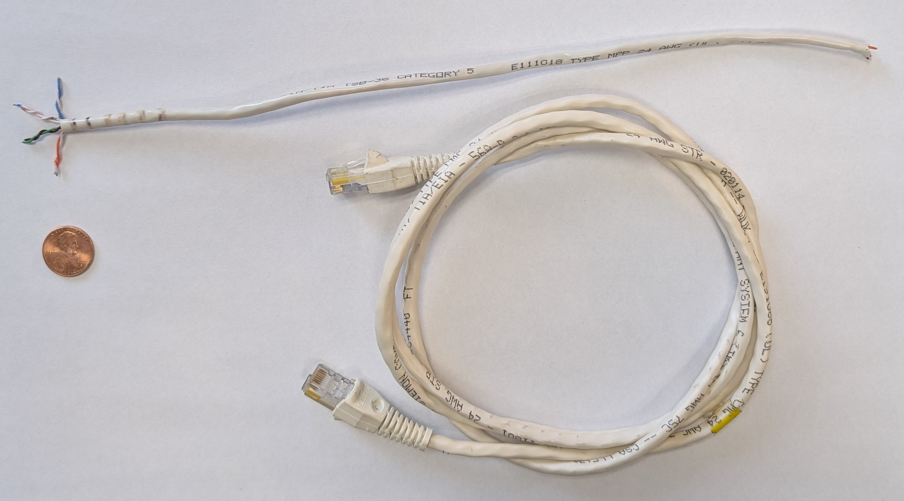
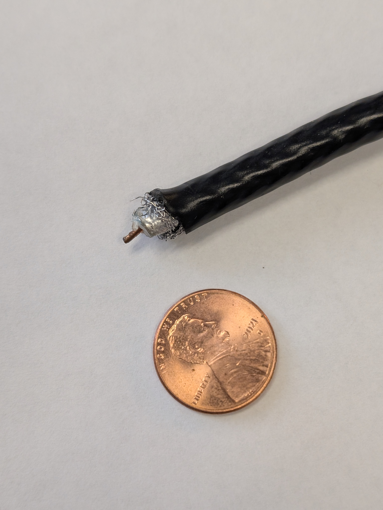
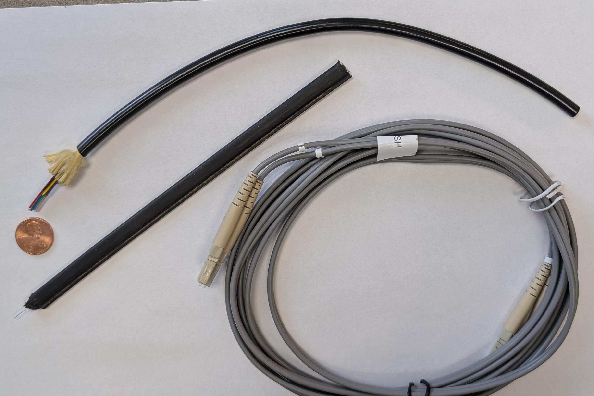
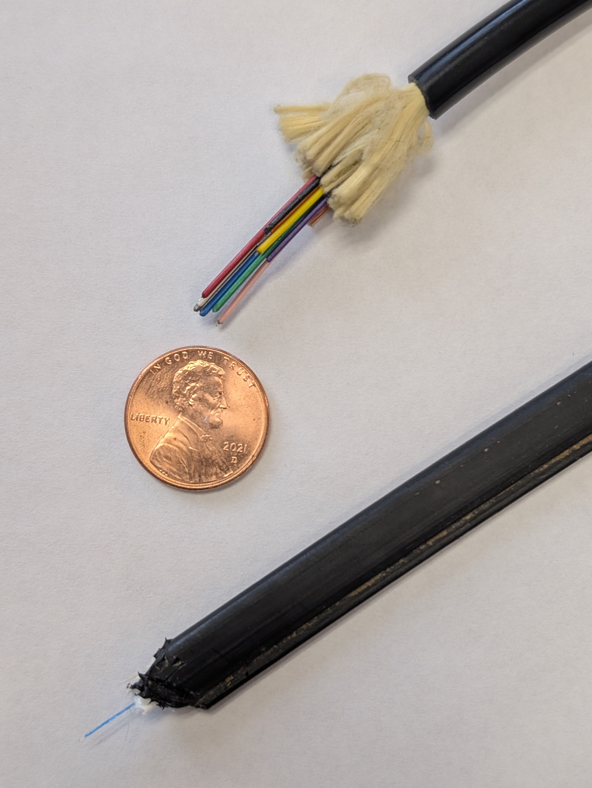
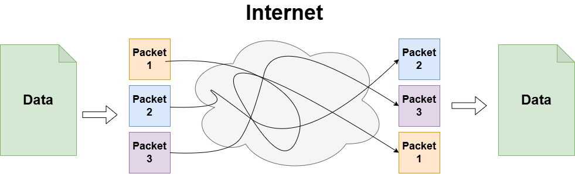
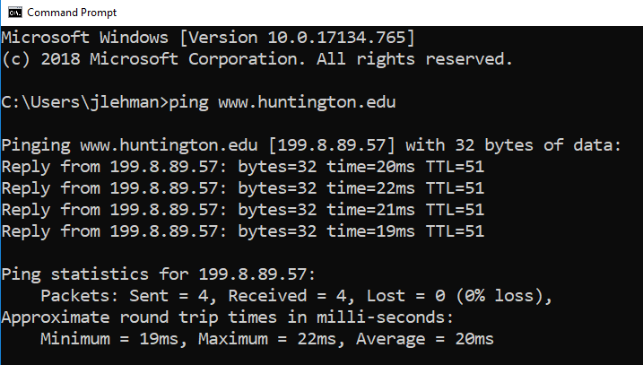
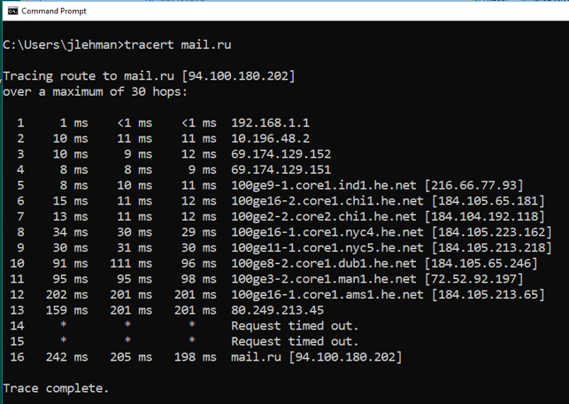

# Networking Overview

**CS 111 – Introduction to Computer Science**
Dr. Jeff Lehman
Huntington University

---

# Networking

## What is a Computer Network?

A **computer network** is a collection of computers that can communicate and share resources.

---

## Client/Server Model

* **Client computers** request resources
* **Server computers** provide resources

Examples of servers:

* Web servers
* File servers
* Print servers

---

## LAN (Local Area Network)

A **LAN (Local Area Network)** is a collection of computers in a small geographic area.

Examples:

* A building
* A group of buildings
* A university campus (e.g., HU campus)


---

# How Are Computers Connected?

## Wired Connections

* **Twisted Pair Wire**

  * Similar to phone cable
  * Often called:
  
    * *Ethernet cable* for protocol.
    * *Cat 5 or 6 cable* for "Categeory" referring to wire diameter and number of wire twists that affect discance a signale can travel.




* **Coaxial Cable**

  * Used for TV cable



* **Fiber Optics**

  * Transmits **light**
  * Not electrical current





---

## Wireless Connections

* **Wi-Fi (802.11)**
* **Cellular wireless**
* **Satellite**

---

# Network Traffic

## Packet

A **packet** is a unit of data sent over a network.



---

# Network Addresses

Computers translate **domain names** into **IP addresses**.

Example:

```
www.huntington.edu → 199.8.89.29
```

---

## IPv4 (Internet Protocol Version 4)

* Each address is stored in **4 bytes**
* Written as four numbers separated by dots

Example:

```
199 . 8 . 89 . 29
```

---

## IPv6 (Internet Protocol Version 6)

* Uses **128 bits**
* Stored in **16 bytes**
* Designed to support many more devices

---

## DNS (Domain Name System)

A **Domain Name Server (DNS)** translates domain names into IP addresses.

---

## ICANN

**ICANN (Internet Corporation for Assigned Names and Numbers)**
Manages Internet domain names.

---

# Static vs Dynamic Addresses

## Static IP Address

* Does **not change**
* Typically used by websites

## Dynamic IP Address

* Changes when connecting to the Internet
* Most personal devices use dynamic addresses

Try this:

* Open a browser
* Search: `"what is my ip"`

---

# Hostnames and Domain Names

A **hostname** or **domain name** identifies a computer on the Internet.

Examples:

* `www.huntington.edu`
* `euclid.huntington.edu`

---

## Top-Level Domains (TLDs)

The **TLD** is the last segment of a domain name.

Examples:

* `.edu`
* `.com`
* `.org`
* `.net`

---

# Protocols

Communication over a network must follow **protocols**.

A **protocol** is a set of rules that govern how messages are sent and received.

---

## TCP/IP

**TCP/IP (Transmission Control Protocol / Internet Protocol)**
The core protocol used by computers on the Internet.

---

## TCP/IP Utilities

### `ping`

* Tests whether a destination is reachable
* Can be used to find the DNS entry for an address




### `tracert` (Trace Route)

* Shows the route a packet takes to reach a destination




---

# High-Level Protocols

These protocols build on TCP/IP:

---

## FTP (File Transfer Protocol)

* Transfers files between computers

---

## Telnet and SSH

* Allow users to log into a remote computer
* SSH is secure

---

## HTTP (Hypertext Transfer Protocol)

* Defines how web pages are exchanged

---

## URL (Uniform Resource Locator)

A **URL** defines a resource on the Internet.

Example:

```
http://www.huntington.edu
```

---

## HTTPS

The **"S"** in HTTPS means:

> **Secure connection**

Data is encrypted between client and server.

---

-- end --